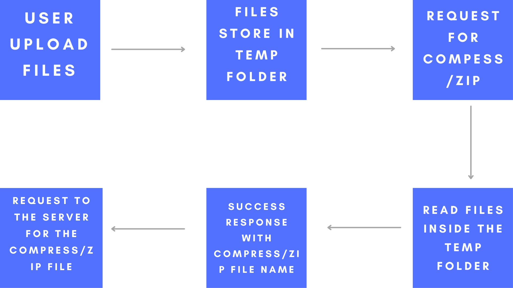

# Zipify

---

## ScreenShot

---

# Working

---

# Setup

 To setup this project to your local system follow these steps :- 

<ul>
<li> Clone code using ` git clone https://github.com/Ayush7614/Zipify.git `</li>
<li> run ` npm install ` to install all node_modules </li>
<li> run ` node app.js ` to run the server </li>
<li> Server will run at Port 80 , open your browser and go to http://localhost </li>
<li> Project is setup successfully 🥳</li>
</ul>

---
# Example :

### Zip a pdf file

https://user-images.githubusercontent.com/76155456/152110795-967a0fff-e656-47a8-9b26-858423ae7ee0.mov

### Compress a pdf file 

https://user-images.githubusercontent.com/76155456/152110896-cc7b842f-d89c-499f-b625-50d339bbbc4b.mov

---

### File Size before zipping and compressing

### File Size after zipping and compressing

